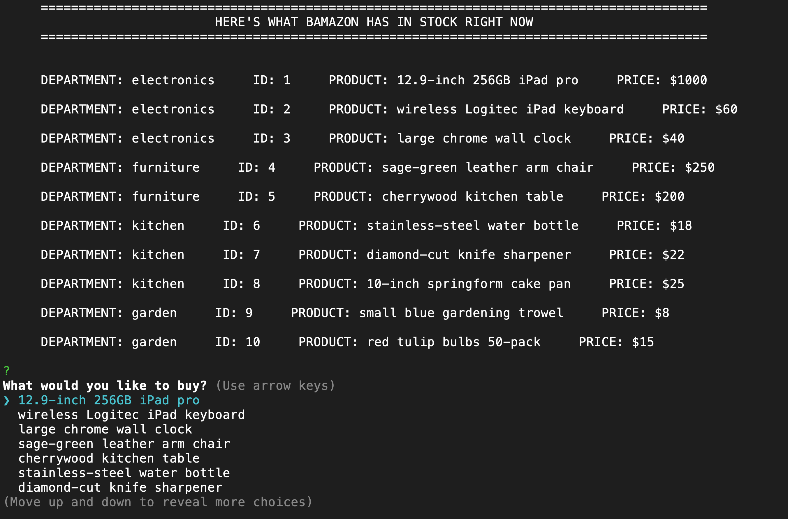

# Bamazon

This application runs through the terminal. When you run Bamazon with node, you will be shown a table of products that are available on Bamazon for sale, along with their prices.

You will then be able to choose from a list which item you would like to buy. After choosing an item, you'll be asked how many of that item you want to purchase. If that many are in stock, you'll be told the total cost of your puchase. Finally you'll be given the option to confirm your order, change your order, or quit. 

If you want to try out Bamazon, download all the files, and then run npm install to install all the dependencies in the package.json file. You will also need to set up your own mySQL database (using the schema in the database directory), and set up your own configuration file called config.js and store that in the database directory. 

Check out the demo video to see how it all works!

## Demos

#### Screenshot

#### Demo video

(https://drive.google.com/open?id=1i8G5Fme_uFfwe07S9O_68mgLfhBiYAk8)

## Contributing & Support

Contributions are closed at this time. Please reach out with any questions.

## Authors

Gray Atkinson-Adams

## License

[MIT](https://choosealicense.com/licenses/mit/)